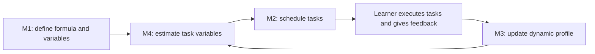

# Axiom — Final Research Direction

**Agreed direction: 5 October 2026. Status: research specification, not a claim that the complete system is implemented or validated.**

Axiom is a **cognitive load based adaptive scheduler**, developed by a team of four and tested in the **learning domain**. It estimates the effort a learning task requires for a particular learner, schedules it using a cognitive load formula, and learns from the learner's actual behaviour. A weekly report shows how that behaviour has changed the initial profile and how the adaptive schedule compares with a fixed-interval baseline.

This document is the authoritative project direction. The plans in [plans/README.md](plans/README.md) describe the research implementation. The application is intentionally limited to the scheduler study workflow; accounts, authentication, unrelated learning tools, and content/trend features are outside scope.

## Team ownership

| Member | Owns | Boundary |
|---|---|---|
| M1 | Cognitive load formula: structure, variables, definitions, units, and valid ranges | Defines what must be estimated; does not estimate per-task values |
| M2 | An optimal scheduling method based on M1's formula and M4's estimates | Owns placement, feasibility, objective, and solver validation; does not update the adaptive profile |
| M3 | Adaptive behaviour and the dynamic user profile | **Only member whose module writes to the profile**, including initialization and user corrections |
| M4 | Accurate estimation of the formula's task variables using the adaptive profile and an LLM's general task knowledge | Reads a profile snapshot; returns estimates and evidence; does not update the profile |

**M1 and M2 jointly own evaluation**, including the fixed-interval baseline, experiment protocol, metrics, and interpretation. M3 supplies profile changes and observations; M4 supplies estimation predictions and error data.

## The loop

M1 publishes a versioned contract. Each run records the formula version, profile version, task revision, estimator version, and scheduling configuration. Replaying saved estimates can reproduce a scheduling run; a fresh LLM call is not assumed to produce identical estimates.

## What M3 adapts

- **Non-availability windows:** commitments and periods in which tasks cannot be placed.
- **Peak focus windows and minimum focus windows:** time periods associated with higher and lower focus, with supporting observations and confidence.
- **Skill level:** topic-specific evidence of learning progress, rather than equating task completion with mastery.
- **Memory of every performed task:** task identity and revision, topic, task type and scope, when it was performed, actual active duration, reported difficulty, completion state, and available assessment evidence.

M3 preserves task-level observations and exposes a bounded relevant-history view to M4. Similar future tasks can therefore receive different duration or difficulty estimates for different learners. Missing feedback stays missing; interrupted tasks are not automatically evidence of low skill. Explicit non-availability is a hard restriction; low-focus windows are not automatically unavailable.

All profile changes go through M3's module. The current research prototype uses a browser-local profile and has no account or authentication requirement. M4 may store an estimation artifact outside the profile, but may not alter history, skill, windows, or calibration state.

## Evaluation and weekly report

There are two distinct references:

1. **Fixed-interval scheduling baseline:** a static study timetable with an agreed session/break pattern and task-order rule. Its definition is frozen before evaluation. It obeys the same externally known availability restrictions and receives the same eligible task set as the adaptive arm. It does not use learned focus windows or task-history calibration.
2. **Initial profile baseline:** the learner's versioned starting profile, retained to explain behavioural changes over time.

The weekly report shows initial versus current availability and focus windows, skill evidence, and actual versus predicted duration/difficulty for comparable tasks. It also shows adaptive versus fixed-interval scheduling outcomes, with sample counts, missing data, and whether values are observed or simulated. A baseline replay is a counterfactual comparison, not evidence that the learner actually performed both schedules.

M1 and M2 agree measures for adherence, completion, deadline misses, reported difficulty/overload, and estimation error before collecting study results. Synthetic checks establish feasibility and integration; learning-domain observations are needed to assess usefulness for learners. No improvement percentages or optimality claims are published without recorded evidence.

## Early integration requirement

Every member ships a stub early, before a full implementation:

| Member | First stub |
|---|---|
| M1 | Versioned variable registry and an explicitly provisional formula evaluator |
| M2 | Feasible scheduling adapter plus fixed-interval baseline implementation |
| M3 | Readable versioned profile fixture, task-history fixture, and an event/update entry point |
| M4 | Deterministic variable estimates matching M1's registry, with provenance and missing-data flags |

M2 builds against these real interfaces immediately. Stub values and fixture results are labelled and excluded from claims of accuracy. Contract changes require a version change and an updated shared fixture.

## Current prototype

The Next.js research workbench provides a natural-language learning-goal page, M4's task breakdown with metrics, visible profile memory used for estimation, an M3-owned browser-local profile and feedback capture, an initial weekly behaviour report, and labelled M1/M2 stubs. Gemini is optional; without a configured key, the page returns a labelled deterministic stub. The adaptive optimizer and measured fixed-interval comparison remain planned research work, and no effectiveness or optimality result is claimed.
