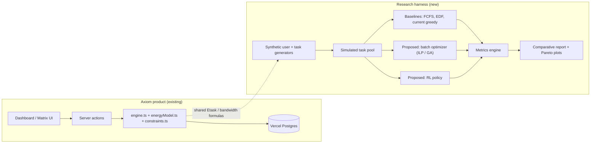

# Axiom: Cognitive-Load-Aware Scheduling, Reformulated

**B.Tech Final-Year Project Brief**
Prepared: 31 July 2026
Scope: Algorithm research + product feature roadmap

A brief covering Axiom's existing feature set, the scheduling engine chosen as the research core, the algorithmic modifications and new features proposed to transform it, and a fully simulation-based evaluation plan that requires no human subjects.

---

## Contents

1. [Overview](#01-overview)
2. [Existing System](#02-existing-system)
3. [Research Focus](#03-research-focus)
4. [Problem Statement & Research Gap](#04-problem-statement--research-gap)
5. [Proposed Modifications to the Existing Engine](#05-proposed-modifications-to-the-existing-engine)
6. [New Features](#06-new-features)
7. [Architecture](#07-architecture)
8. [Research Methodology — No Human Testing](#08-research-methodology--no-human-testing)
9. [Evaluation Metrics](#09-evaluation-metrics)
10. [Expected Contributions](#10-expected-contributions)
11. [Tech Stack](#11-tech-stack)
12. [Indicative Timeline](#12-indicative-timeline)
13. [Risks & Mitigations](#13-risks--mitigations)
14. [Grounding & Related Work Areas](#14-grounding--related-work-areas)

---

## 01 · Overview

Axiom is a Next.js application that turns goals, coursework, and daily tasks into a schedule aware of cognitive load, energy windows, deadlines, and user feedback. It already ships a deterministic scheduling engine, an energy-budget model, and a family of Gemini-backed learning-content generators (roadmaps, courses, flashcards, cheatsheets, stories).

Architecturally, Axiom is a closed loop, not a bag of independent features:

- **What to learn** — the trend engine (`trend-engine/`), surfacing topics from Hacker News, Reddit, and NewsAPI signals.
- **How to learn** — the material generators (roadmap, course, assessment, cheatsheet, flashcard, short-bit, story agents), turning a topic into learning content.
- **When to learn** — the scheduling engine, placing that content into time against cognitive load, energy, and deadlines.

This brief repurposes Axiom as a final-year project by:

- **(a)** isolating the **When** pillar — the scheduling engine — as the subject of a formal research contribution, since it is the one fully deterministic, rule-based stage and so the one whose quality can be measured purely computationally,
- **(b)** proposing concrete modifications to that engine grounded in optimization and learning theory, and
- **(c)** proposing new features that strengthen all three pillars of the loop, not just the scheduler in isolation.

The research design is built so every claim can be evaluated computationally, against synthetic data, with no human trials, surveys, or user studies.

---

## 02 · Existing System

Everything below is already implemented in `client/src/lib/`. It forms the baseline the research modifies and the platform the new features attach to. The **Loop** column marks which pillar (What / How / When) each feature belongs to.

| Feature | Loop | Core module(s) | What it does |
|---|---|---|---|
| Trend engine | What | `trend-engine/` | Aggregates Hacker News, Reddit, and NewsAPI signals and maps them to learning topics. |
| Roadmap generation | What → How | `roadmap-agent.ts` | Gemini-driven DAG of learning topics personalised to profile, goal, and mastery scores; bridges topic discovery into content generation. |
| Course & slide generation | How | `course-agent.ts`, `slide-prompts.ts` | Generates a course skeleton and per-slide content from a title, description, and prompt. |
| Assessment generation | How | `assessment-agent.ts` | Generates mixed-format quiz assessments per topic. |
| Cheatsheet generation | How | `cheatsheet-agent.ts` | Structured exam cheat-sheets: key points, formulas, pitfalls, quick checks. |
| Flashcards | How | `flashcard-agent.ts` | Front/back flashcard sets with deterministic fallback content. |
| Short-bit micro-learning | How | `short-bit-agent.ts` | Bite-size illustrated learning items for quick review. |
| Story-mode learning | How | `story-agent.ts` | Narrative chapters that teach a topic in web-novel form. |
| Cognitive-load scheduler | When | `engine.ts`, `schedule.ts` | Greedy heuristic placing tasks into 15-min slots across a 7-day, 96-slot/day window using an Etask load formula, an ultradian bandwidth curve, and a fitness score. |
| Axiom energy-budget model | When | `energyModel.ts` | 50-axiom daily budget split 0.40 / 0.35 / 0.25 across morning / afternoon / evening; feedback rule reweights sections from actual-vs-scheduled efficiency ratios. |
| Burnout risk detection | When | `engine.ts` — `calculateBurnoutRisk` | Classifies safe / watch / warning / critical from a rolling 3-day window of scheduled axiom usage. |
| Load balancing & anti-starvation | When | `constraints.ts` | Shannon-entropy diversity scoring over task types, plus a rule that inserts a lower-priority task after three consecutive high-priority ones. |
| Task scoring | When | `scoring.ts` | Deterministic priority score combining urgency, difficulty, and priority, normalised by Etask cost. |
| Adaptive calibration | When | `engine.ts`, `energyModel.ts` | Adjusts per-type load multipliers and section weights from historical task-completion rates. |
| Weekly matrix view | — | `matrix-util.ts` | Builds the 96×7 slot matrix merging profile overlays with scheduled tasks for the UI. |
| Auth & persistence | — | `app/actions/`, `userProfileStorage.ts` | JWT-cookie authentication and Vercel Postgres persistence. |

---

## 03 · Research Focus

The scheduling engine (`engine.ts` + `energyModel.ts` + `constraints.ts`) — the **When** pillar of the What/How/When loop — is the chosen subject, and the only pillar carried through formal research/evaluation. The trend engine (**What**) and material generators (**How**) stay in scope as the system the scheduler serves, but are deliberately scoped as an **engineering showcase** instead (§06) — demonstrating LLM orchestration and adaptive-LLM technique, judged on demo sophistication rather than experimental rigor.

The scheduler is fully deterministic and rule-based — no LLM call, no human judgment sits inside the algorithm — which makes it the one part of Axiom whose quality can be measured purely computationally. Its current formulas:

```
Etask         = difficulty × durationWeight × deadlineUrgency × |typeMultiplier| × priorityWeight
Fitness(slot) = bandwidth − Etask + productiveHourBonus + contextSwitchPenalty + deadlineProximityBonus
L_day         = Σ (difficulty × completionTime)                      // constraints.ts
H             = −Σ p_i log₂(p_i)                                     // type-diversity entropy
E_axiom_task  = 0.6 × difficulty² + 0.8 × priority_num                // energyModel.ts
new_weight    = old_weight × (1 + 0.2 × (efficiencyRatio − 1))        // feedback update
```

These are hand-tuned constants and a single-pass greedy placement loop — a reasonable product heuristic, but an unverified one. That gap is the thesis.

---

## 04 · Problem Statement & Research Gap

`runSchedulingAlgorithm` sorts tasks once (urgency → priority → sequence → |Etask|) and places each greedily into the best-scoring free slot before moving to the next task. This is order-dependent: an early task can occupy a slot that would have produced a strictly better global arrangement had a later task been placed first. The engine also optimises a single scalar fitness score, collapsing deadline risk, burnout risk, and focus continuity into one number with no visibility into the trade-off between them.

**Research question:** for a cognitive-load-constrained personal scheduling problem, how much of the greedy heuristic's schedule quality is left on the table relative to a global batch optimizer, and what is the actual shape of the trade-off between deadline risk and burnout risk that the current single-score design hides?

---

## 05 · Proposed Modifications to the Existing Engine

| Change | Current behaviour | Proposed behaviour |
|---|---|---|
| Batch optimizer | Greedy, order-dependent per-task placement loop | Reformulate as a resource-constrained scheduling problem (CP-SAT / ILP, or GA as a metaheuristic fallback) solved once per horizon over the full task pool |
| Duration modeling | Fixed `completionTime` point estimate | Model duration as a distribution; place tasks against Monte-Carlo risk of overrun rather than a single number |
| Calibration rule | Linear ratio update, `new_weight = old × (1 + α(R−1))` | Bayesian update over section weights and type multipliers, with a credible interval instead of a point estimate |
| Fitness scoring | Single scalar score blending five weighted terms | Multi-objective (Pareto) scheduling — explicit deadline-risk vs. burnout-risk surface, no forced weighting |

---

## 06 · New Features

**Strengthening the When pillar (research core)**

- **RL Scheduling Policy** — A policy trained inside a simulated gym-style environment: state is the task queue + profile, action is a slot assignment, reward is the weighted metric set from §09. Trainable and testable entirely offline.
- **Simulation Sandbox** — An N-day preview that runs any scheduler variant against a synthetic or real task pool before committing a plan. Doubles as the reusable evaluation harness for every experiment in this brief.
- **Multi-Agent Team Scheduling** — Extends the single-user Etask/axiom-budget model to a shared budget across a project team — a genuine extension of the current model, not a UI feature.
- **Explainable-Scheduling Fidelity Layer** — Axiom already emits a `reasoningChain` per placement. This formalises it: measure, via controlled ablation, whether the stated reason actually drove the decision — an automated fidelity metric, no human rater required.
- **Open Synthetic Benchmark** — Package the synthetic user- and task-stream generators (§08) as a standalone, reusable benchmark — a citable artifact independent of the algorithm results themselves.

**Closing the loop (What ↔ How ↔ When)**

- **Mastery-Weighted Trend Ranking (When → What)** — Feed the scheduler's per-type completion-rate calibration (`computeCalibratedMultipliers`) back into the trend engine's topic ranking, so topics the user is actually struggling with surface higher, instead of trend scoring running one-way and blind to scheduling outcomes.
- **Performance-Aware Generation (When → How)** — Material generators currently produce content at a fixed level regardless of user performance. Pass the same calibration signal into the generator prompts so difficulty/format adapts to demonstrated mastery, not just a static profile field.

Together with the existing roadmap agent (already the What→How bridge), these two additions turn the three pillars into an actual closed loop instead of three one-way stages.

**Engineering showcase (What/How) — not part of the research track**

Scope decision: **When** is the only pillar carried through formal research/evaluation (§08–§09). What and How are judged on engineering sophistication in the demo, not experimental rigor — deliberately built to showcase current LLM-orchestration and adaptive-LLM technique.

*What (trend engine):*
- **Multi-agent trend pipeline** — replace single fetch+score with fetch-agent → dedupe/cluster-agent → LLM relevance-filter-agent → summarizer-agent → mastery-gap re-ranker, instead of one flat scoring pass.
- **Tool-calling source selection** — an LLM decides which source to query per topic domain (HN for tech, Reddit for niche communities, News for current events) rather than always querying all three.
- **RAG-grounded roadmap generation** — embed trend articles (pgvector or equivalent), retrieve relevant chunks to ground `roadmap-agent` output and reduce hallucination.

*How (material generators):*
- **Self-refinement loop** — generator drafts content, a critic LLM call scores it against a rubric, regenerate below threshold (Reflexion-style). Doubles as an automated quality gate — but this is an LLM judge, not human testing evidence, and should stay clearly separate from the §08 no-human-testing research claims.
- **Model routing** — cheap/fast model for flashcards, stronger model for course slides/assessments, chosen per task complexity.
- **Adaptive in-context learning** — retrieve best-matching few-shot examples from the user's own history/mastery instead of static prompt templates.
- **Performance-aware generation** (carried over from the loop-closing item above) also lives here as an adaptive-LLM technique in its own right.

---

## 07 · Architecture

The research harness sits alongside the product, sharing the same load/energy formulas but never touching production data.



*Fig. 1 — the research harness reuses Axiom's existing formulas but runs entirely against simulated data.*

---

## 08 · Research Methodology — No Human Testing

> **Every experiment in this plan is computational.** Inputs are generated by parameterised random distributions, not collected from people; outcomes are logged metrics, not survey responses. This removes the need for informed consent, IRB review, or recruiting participants.

1. **Synthetic user generator** — Sample wake/sleep times, peak-focus windows, section weights, and energy-multiplier profile from parameterised distributions grounded in the existing ultradian bandwidth curve in `generateDefaultBandwidthCurve`.
2. **Synthetic task-stream generator** — Poisson task arrivals; randomised difficulty, duration, deadline, type, and priority drawn from ranges matching Axiom's existing `TaskType`/`TaskPriority` domains.
3. **Algorithm bank** — FCFS and EDF as naive baselines, the current greedy-fitness heuristic as the production baseline, plus the proposed batch optimizer(s) and RL policy as candidates.
4. **Simulated runs** — Every algorithm plays out identical synthetic scenarios over 7 / 14 / 30-day simulated horizons, repeated across many random seeds for statistical power.
5. **Metric logging** — Each run logs the full metric set in §09 automatically — no manual scoring step.
6. **Statistical comparison** — Paired comparison across identical seeds (paired t-test / Wilcoxon signed-rank), plus a Pareto-front plot of deadline-risk vs. burnout-risk per algorithm.

---

## 09 · Evaluation Metrics

| Metric | Definition | Why it matters |
|---|---|---|
| Feasibility rate | % of tasks placed without conflict | Baseline scheduling capability |
| Deadline-miss rate | % of tasks placed after, or unplaceable before, their deadline | Urgency-handling quality |
| CL variance | Variance of daily aggregate `L_day` across the horizon | How evenly load is smoothed, not just totalled |
| Context-switches / day | Subject transitions per scheduled day | Focus-continuity quality |
| Burnout-incident rate | % of simulated days classified warning/critical | Wellbeing safety of the plan |
| Axiom utilisation | Average % of daily budget consumed | Efficiency of budget use |
| Solve time | Wall-clock time per scheduling run | Practicality / scalability of the optimizer |
| Explanation fidelity | Agreement between the stated `reasoningChain` driver and the ablation-measured actual driver | Validates the XAI layer without a human rater |

---

## 10 · Expected Contributions

- Quantified gap between greedy heuristic and global batch optimizer on a real, deployed cognitive-load scheduling formulation — not a toy problem.
- An explicit Pareto trade-off (deadline risk vs. burnout risk) where the current system exposes only a single blended score.
- A reusable, open synthetic benchmark for cognitive-load-constrained personal scheduling.
- An automated, human-free fidelity metric for the reasoning-chain explanation layer.

Suggested paper title: *"Cognitive-Load-Constrained Task Scheduling: A Simulation-Based Comparison of Heuristic and Optimization Approaches."*

---

## 11 · Tech Stack

| Layer | Tooling |
|---|---|
| Product | Next.js 16 (App Router), React 19, TypeScript, Tailwind CSS 4, Vercel Postgres, JWT |
| AI content agents | Gemini API |
| Research harness | TypeScript or Python for generators/baselines; OR-Tools CP-SAT for ILP; a GA/SA library for the metaheuristic path; a lightweight RL loop (e.g. tabular or small policy-gradient) for the RL path |
| Analysis | Pandas/NumPy or equivalent for metric aggregation; matplotlib-class plotting for Pareto fronts |

---

## 12 · Indicative Timeline

1. **Weeks 1–2 — Formalise the model.** Literature grounding (§14) and formal write-up of the scheduling problem as a constrained optimization.
2. **Weeks 3–5 — Build the harness.** Synthetic user/task generators, baseline algorithms (FCFS, EDF, current greedy), metrics engine.
3. **Weeks 6–9 — Implement proposed optimizer(s).** ILP/GA batch optimizer first; RL policy if time allows.
4. **Weeks 10–12 — Run experiments.** Execute all algorithms across seeds/horizons, collect metrics, run statistical tests, plot Pareto fronts.
5. **Weeks 13–14 — Integrate + write up.** Feature-flag the best-performing optimizer back into the product; draft the paper.
6. **Weeks 15–16 — Stretch features.** Sandbox preview and/or team scheduling, as scope allows; final report and defense.

---

## 13 · Risks & Mitigations

| Risk | Mitigation |
|---|---|
| ILP solve time grows too fast at scale | Decompose by time window, or fall back to the GA/SA metaheuristic path |
| RL policy fails to converge | Reward shaping and curriculum; treat RL as a stretch goal behind the ILP/GA result |
| Synthetic data judged unrepresentative | Ground distributions in the existing ultradian bandwidth curve; run sensitivity analysis across parameter ranges |
| Five new features is too much scope | Treat only the batch optimizer + evaluation harness as the core deliverable; the rest are stretch goals |

---

## 14 · Grounding & Related Work Areas

Areas to review while writing the formal literature section — not a citation list.

- Cognitive Load Theory (Sweller) — theoretical basis for the Etask formulation.
- Ultradian rhythm / basic rest-activity cycle research — basis for the bandwidth curve's shape.
- Classical scheduling theory — earliest-deadline-first and priority scheduling as baselines.
- Operations research — resource-constrained project scheduling (RCPSP) and bin-packing formulations for the batch optimizer.
- Metaheuristics — genetic algorithms and simulated annealing as the fallback optimizer path.
- Reinforcement learning for scheduling — job-shop and calendar-scheduling RL literature.
- Explainable AI evaluation — ablation-based attribution and fidelity metrics for the reasoning-chain layer.

---

*Axiom project brief — existing features audited from `client/src/lib/` and `readme.md` as of 31 July 2026. Modification and new-feature proposals are unimplemented design recommendations.*
